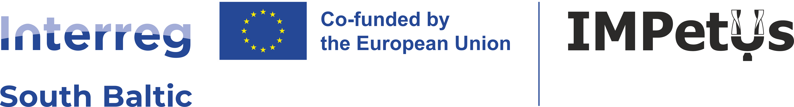

# IMPETUS – IMPET build your wind energy future with US
## Enhancing wind energy production in the South Baltic area through student-driven innovation and cross-border collaboration.
IMPETUS project is co-financed from the Interreg South Baltic Programme 2021-2027 through the European Regional Development Fund (Project: IMPETUS, STHB.02.01-IP.01-0001/25).
## Project Consortium
Impetus consortium consists of 7 partners from Poland, Germany, Lithuania, and Sweden. The Lead Partner is the Institute of Fluid-Flow Machinery, Polish Academy of Sciences (IMP PAN). 
# Project Overview
The IMPETUS Project aims to boost the green and blue growth potential of the South Baltic Area (SBA) by fostering innovation in renewable energy. Through cross-border collaboration, it focuses on developing Vertical Axis Wind Turbine (VAWT) technology as a cleaner, more efficient, and sustainable alternative to conventional wind systems.
# Key Focus Areas
- Promote cross-border collaboration in the South Baltic Area (SBA) for renewable energy innovation.
- Develop superior efficiency Vertical Axis Wind Turbines (VAWTs) through student-led competitions.
- Establish an Open Access Repository with models, designs, fabrication know-how, and results.
- Support SME creation and spin-offs, encouraging entrepreneurship in the renewable sector.
- Advance blade pitch control technologies (passive, active, and cluster-level) to enhance VAWT performance.
# Repo
This repository is created to share code with students involved in the VAWT development competitions, as well as other researchers and organisations interested in wind energy.

The details can be found at [https://www.impetus.eu/](https://www.impetus.eu/)

